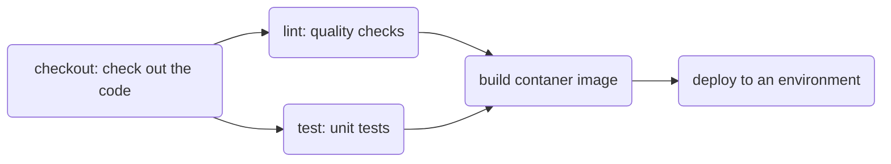

# [Continuous Integration and Continuous Delivery (CI/CD) Course by Coursera🚀🔁](https://www.coursera.org/learn/continuous-integration-and-continuous-delivery-ci-cd)

👍Pros: tbd

👎Cons: tbd

⌚Duration: tbd

💯Overall: _/10

## Intorduction🌱

Continuous Integration (CI):
- Code repo and version control
- Build and integration automation

Continuous Delivery (CD):
- release automation
- delivery automation

Continuous Deployment (or Continuous Production, CP):
- product automation

**CI/CD is two separate and distinct processes that happen sequentially**

**CI**: integrate code back into the main or master branch➡️
➡️ **CD**: take integrated code and deploy it somewhere like a staging, testing, or preproduction server➡️
➡️ **Continuous Deployment**: deliver the code to production


CI = Plan, Code, Build, and Test phases

CD = Release, Deploy, and Operate phases

CI/CD sits in the Build and Test phases of the DevOps pipeline

With CI/CD, you get the following: 
- Faster reaction times to changes 
- Reduced code integration risk 
- Higher code quality 
- Confirmation that the code in version control works.

**Social coding** leads to high-quality code and increased collaboration, saving time, effort, and money. 

## Continuous Integration (CI)
**CI is:**
- an automation process that helps developers continuously integrate code by using **short-lived branches**. 
- **frequent pull requests** that are easy to review and encourage collaboration. 
- automatically runs code through predefined tests, streamlining development. 


**Git** enables DevOps and has many commands that provide essential functionality. Git Feature Branch **Workflow**:
1. Clone a repository to your local system and create a branch to work on your issue.
2. Commit changes to that branch.
3. Push your changes to the remote branch.
4. Issue a pull request to have your work reviewed.
5. Merge your code to the main branch and close the issue. 

**Git:**
```
git checkout main
git pull
git checkout -b feature-1
...some coding here...
git add .
git commit -m 'initial working version of the new feature'
git push -u origin feature-1
```

Before a pull request:
```
git checkout main
git pull
git checkout my-new-feature
git merge main
...fix any merge conflicts...
git add .
git commit -m 'merged updates from main'
git push
```

After a pull request:
```
git checkout main
git pull
git checkout -d my-new-feature
git checkout -b my-new-feature-2
```

**CI tools**: Jenkins, CircleCI, TravisCI, and GitHub Actions, etc.

### GitHub Actions

GitHub Actions: CI/CD tool available on every GitHub repository. 

GitHub Actions provides starter code to get your workflow up and running quickly. 
Configure GitHub Actions: create `.github/workflows` folder and place workflow YAML files in it.

Workflow components include **events, jobs, runners, steps, and actions. **

## Continuous Delivery (CD)

WHY CD:
- Minimizing Deployment Risks (software is always ready for release ->> teams can deploy changes more frequently)
- Faster Time to Market (quicker release cycles ->> organization can respond to market demands and user feedback faster)
- Improved Software Quality (automated testing and deployment processes ->> catch issues early ->> higher quality releases)
- Enhanced Collaboration (better collaboration between development and operations teams, aligning their goals and processes)

Best Practices: 
- Automated Testing: Incorporating automated tests at various stages of the pipeline to ensure code quality.
- Version Control: Using version control systems to manage code changes effectively.
- Monitoring and Feedback: Implementing monitoring tools to gather feedback on deployments and improve future releases.

Tools for CD: 
- OpenShift Pipelines: A Kubernetes-native CI/CD solution that allows for the creation of pipelines to automate the deployment process.
- Argo CD: A declarative, GitOps continuous delivery tool for Kubernetes that helps manage application deployments.
- etc

CD pipeline:



## Pipeline Tools and Best Practices

- DevOps pipeline: workflow that automates software delivery.
- CI pipeline: versioning and resource preparation
- CD pipeline: a smooth transition to production.
- Continuous compliance pipeline: maintains security and compliance standards (tools: DevOps Insights, Secrets Manager).
